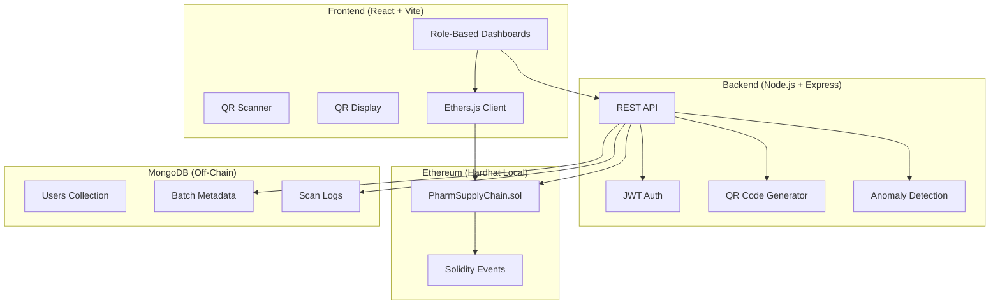

# Blockchain-Based Pharmaceutical Supply Chain & Anti-Counterfeit System

## System Architecture

### On-Chain vs Off-Chain Data Separation

| Data | Storage | Rationale |
|------|---------|-----------|
| Batch ID, manufacturer address, current owner, transfer history hashes | **On-Chain** | Critical verification data, immutable |
| Medicine name, description, images, dosage info | **Off-Chain (MongoDB)** | Large metadata, not needed for verification |
| User profiles, credentials | **Off-Chain (MongoDB)** | Private data, mutable |
| QR scan logs, anomaly events | **Off-Chain (MongoDB)** | High-frequency writes, analytics |
| Ownership transfer events | **On-Chain (Events)** | Auditable, indexed |

---

## Proposed Changes

### Phase 1: Smart Contracts

#### [NEW] [hardhat.config.js](file:///c:/Users/harsh/Desktop/blockchain%20project/hardhat.config.js)
- Hardhat configuration with Solidity 0.8.19, local network settings

#### [NEW] [PharmSupplyChain.sol](file:///c:/Users/harsh/Desktop/blockchain%20project/contracts/PharmSupplyChain.sol)
- **Roles**: Manufacturer, Distributor, Pharmacy, Consumer, Admin — managed via role enum + mappings
- **Structs**: `Batch` (batchId, manufacturer, currentOwner, createdAt, expiryDate, dataHash, isActive, transferCount)
- **Functions**:
  - `registerStakeholder(address, role)` — Admin only
  - `createBatch(batchId, dataHash, expiryDate)` — Manufacturer only
  - `transferBatch(batchId, newOwner)` — Current owner only, validates role progression (Mfg→Dist→Pharm→Consumer)
  - `getBatch(batchId)` — Public view
  - `getBatchHistory(batchId)` — Returns transfer event log
  - `verifyBatch(batchId)` — Returns validity + current owner
- **Events**: `BatchCreated`, `BatchTransferred`, `StakeholderRegistered`
- **Access Control**: Role-based modifiers, transfer chain validation

#### [NEW] [deploy.js](file:///c:/Users/harsh/Desktop/blockchain%20project/scripts/deploy.js)
- Deploy contract, register initial admin account

#### [NEW] [PharmSupplyChain.test.js](file:///c:/Users/harsh/Desktop/blockchain%20project/test/PharmSupplyChain.test.js)
- Test all contract functions: registration, batch creation, transfers, access control, edge cases

---

### Phase 2: Backend (Node.js + Express)

#### [NEW] [server.js](file:///c:/Users/harsh/Desktop/blockchain%20project/backend/server.js)
- Express server, middleware, route mounting

#### [NEW] [backend/config/](file:///c:/Users/harsh/Desktop/blockchain%20project/backend/config/)
- `db.js` — MongoDB connection
- `blockchain.js` — Ethers.js provider + contract instance

#### [NEW] [backend/models/](file:///c:/Users/harsh/Desktop/blockchain%20project/backend/models/)
- `User.js` — username, email, password (hashed), role, walletAddress
- `BatchMetadata.js` — batchId, medicineName, description, dosage, sideEffects, qrCodeUrl
- `ScanLog.js` — batchId, scannedBy, location, timestamp, ipAddress, flagged

#### [NEW] [backend/routes/](file:///c:/Users/harsh/Desktop/blockchain%20project/backend/routes/)
- `auth.js` — POST /register, POST /login
- `batch.js` — POST /create, POST /transfer, GET /:id, GET /:id/history
- `verify.js` — POST /scan, GET /verify/:batchId
- `admin.js` — GET /stakeholders, POST /register-stakeholder

#### [NEW] [backend/middleware/](file:///c:/Users/harsh/Desktop/blockchain%20project/backend/middleware/)
- `auth.js` — JWT verification middleware
- `roleCheck.js` — Role-based route guard

#### [NEW] [backend/services/](file:///c:/Users/harsh/Desktop/blockchain%20project/backend/services/)
- `qrService.js` — Generate QR codes using `qrcode` npm package
- `anomalyService.js` — Detect duplicate scans, multiple-location scanning, rapid successive scans
- `blockchainService.js` — Wrapper for contract interactions

---

### Phase 3: Frontend (React + Vite)

#### [NEW] [frontend/](file:///c:/Users/harsh/Desktop/blockchain%20project/frontend/)

**Core Structure:**
- `src/App.jsx` — Router with protected routes
- `src/main.jsx` — Entry point with providers
- `src/index.css` — Global design system (dark theme, gradients, animations)

**Pages:**
- `src/pages/Login.jsx` — Login form with role selection
- `src/pages/Register.jsx` — Registration with wallet connection
- `src/pages/Dashboard.jsx` — Role-aware dashboard router
- `src/pages/ManufacturerDashboard.jsx` — Create batches, view own batches
- `src/pages/DistributorDashboard.jsx` — Accept transfers, forward batches
- `src/pages/PharmacyDashboard.jsx` — Accept batches, transfer to consumer
- `src/pages/ConsumerDashboard.jsx` — Scan QR, verify medicine
- `src/pages/AdminDashboard.jsx` — Register stakeholders, view all batches
- `src/pages/VerifyMedicine.jsx` — QR scan + blockchain verification display

**Components:**
- `src/components/BatchCard.jsx` — Batch info display
- `src/components/SupplyChainTimeline.jsx` — Visual ownership history
- `src/components/QRScanner.jsx` — Camera-based QR scanner
- `src/components/QRDisplay.jsx` — Display batch QR code
- `src/components/Navbar.jsx` — Navigation with role-aware menu
- `src/components/TransferForm.jsx` — Batch transfer form

**Services:**
- `src/services/api.js` — Axios API client
- `src/services/blockchain.js` — Ethers.js contract interaction
- `src/context/AuthContext.jsx` — Authentication state

---

### Phase 4: Integration & Configuration

#### [NEW] [package.json (root)](file:///c:/Users/harsh/Desktop/blockchain%20project/package.json)
- Hardhat + testing dependencies

#### [NEW] [.env.example](file:///c:/Users/harsh/Desktop/blockchain%20project/.env.example)
- Template for environment variables

#### [NEW] [README.md](file:///c:/Users/harsh/Desktop/blockchain%20project/README.md)
- Complete setup instructions, architecture overview, API docs

---

## User Review Required

> [!IMPORTANT]
> **MongoDB Requirement**: The backend requires a running MongoDB instance. The plan assumes `mongodb://localhost:27017/pharma-supply-chain`. Confirm if you have MongoDB installed locally or prefer MongoDB Atlas (cloud).

> [!IMPORTANT]
> **MetaMask Integration**: The frontend will connect to MetaMask for wallet signing. On the local Hardhat network, you'll need to import Hardhat test accounts into MetaMask. Instructions will be in the README.

> [!WARNING]
> **Local Development Only**: This setup uses Hardhat's local blockchain. No real ETH or testnet deployment is included. The system is designed for demonstration/development purposes.

## Open Questions

1. **MongoDB**: Do you have MongoDB installed locally, or should I configure it for MongoDB Atlas?
2. **UI Complexity**: Should the frontend be a basic functional UI, or do you want a polished design with animations and modern aesthetics?
3. **QR Scanning**: For the consumer QR scanning, should it use the device camera (requires HTTPS or localhost), or is a text-input-based verification acceptable as fallback?

## Verification Plan

### Automated Tests
- `npx hardhat test` — Run all smart contract tests
- Backend API testing via manual curl/Postman commands documented in README
- Frontend: manual browser testing on `http://localhost:5173`

### Manual Verification
1. Deploy contract to local Hardhat node
2. Register stakeholders via Admin dashboard
3. Create a batch as Manufacturer
4. Transfer batch through supply chain: Manufacturer → Distributor → Pharmacy → Consumer
5. Scan QR code as Consumer — verify full history displays
6. Attempt unauthorized transfer — verify rejection
7. Simulate duplicate scan — verify anomaly detection
